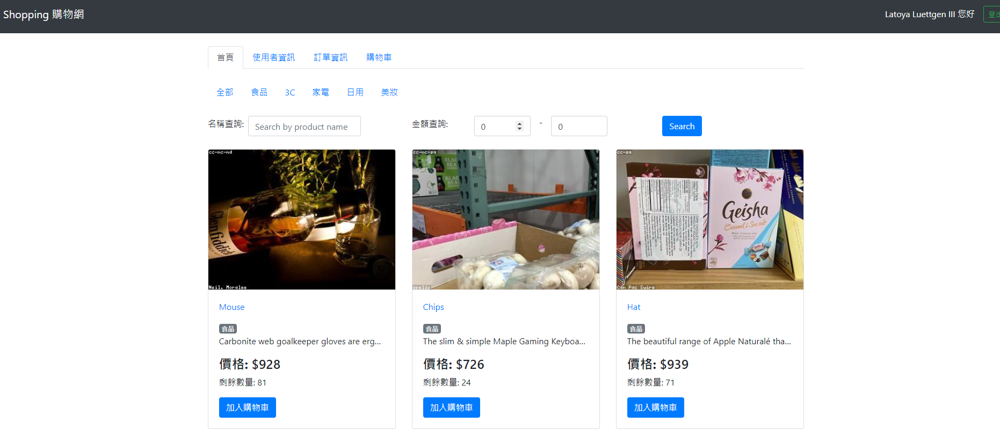
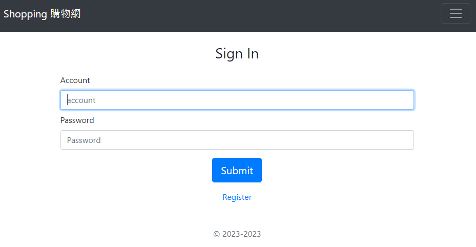
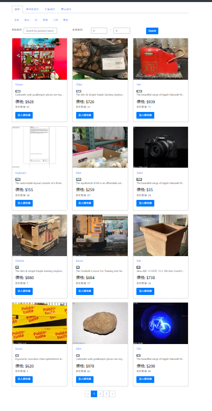
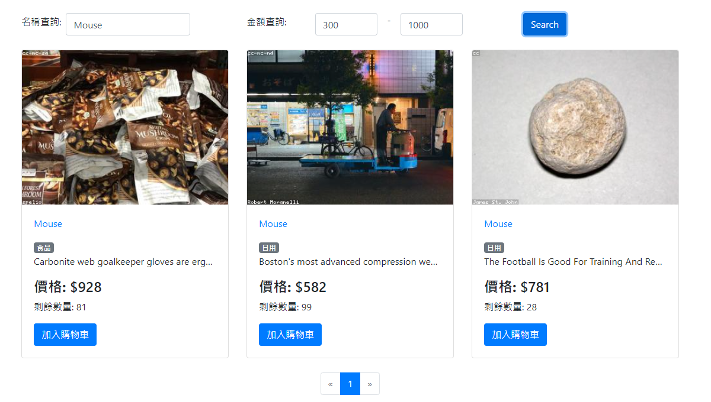
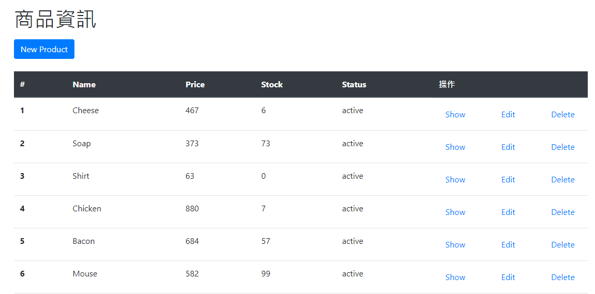
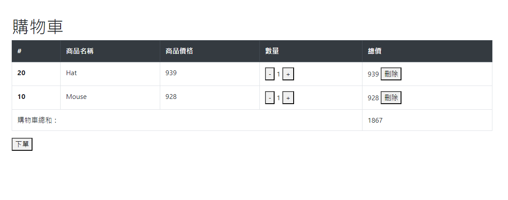
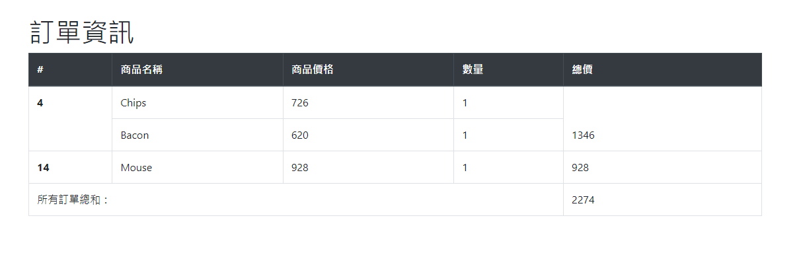

# 購物網站



## 介紹

這是一個使用 Vue3 + Node.js + MySQL 打造的購物網站，佈署在 heroku 上方
https://ian920511.github.io/shopping-front-end/

---

## 功能

- 使用者需註冊會員並登入才能購物網站

- 可以觀看全部商品

- 可以使用分類、關鍵字、金額範圍來查看及搜尋商品

- 賣家可以新增、刪除、修改商品資訊

- 買家可以新增、刪除、修改購物車內容

- 使用者可以在訂單資訊觀看購買或賣出資訊


---

## 開始使用

1.先確認有安裝 node.js 與 npm

2.開啟終端機(Terminal)，clone 此專案

```bash
git clone https://github.com/Ian920511/shopping-front-end.git
```

3.初始化

```bash
cd shopping-front-end //進入存放檔案的資料夾
npm install  //安裝插件
```

4.完成後，輸入

```bash
npm run serve
```

5.啟動成功 frontend 會看到啟動的 Local 網址


6.可以使用以下帳號密碼進行登入測試

```bash
賣家:
account: seller001
password: titaner

買家:
account: buyer001
password: titaner
```

7.若需要暫停伺服器，則輸入

```bash
ctrl + c
```

---

## 規格

- 程式編輯器: [Visual Studio Code](https://visualstudio.microsoft.com/zh-hant/ "Visual Studio Code")
- 使用框架: [Vue]
- 路由管理: [VueRouter]
- 使用者狀態管理: [pinia]

- 其他工具及版本請詳見 package.json

